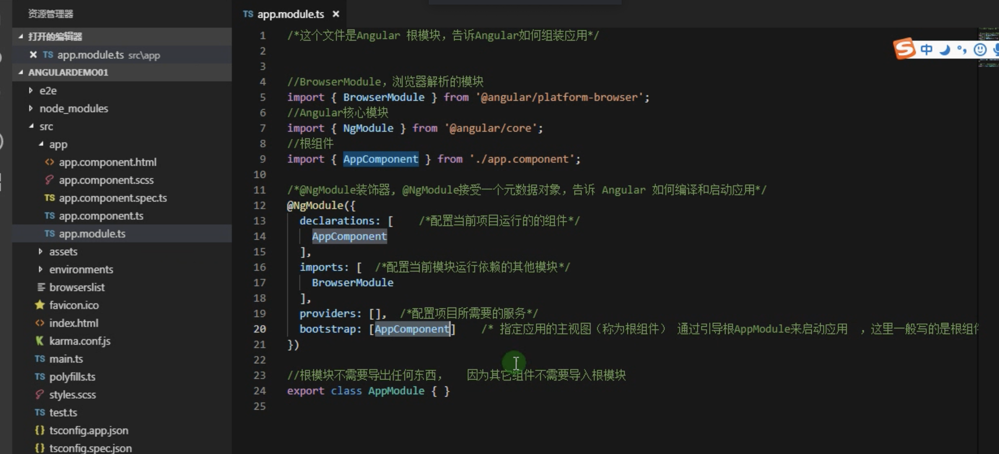

# angular

## 搭建
```

npm install -g @angular/cli
ng new demo01 --skip-install
ng g compontent compontents/home  # 创建home组件
ng sever --open                   # 启动
```


## 模块说明



Module
Component
Template
Metadata
Data Binding
Service
Directive
Dependency Injection


## 过滤器

currency	格式化数字为货币格式。
filter	从数组项中选择一个子集。
lowercase	格式化字符串为小写。
orderBy	根据某个表达式排列数组。
uppercase	格式化字符串为大写。


## Service

在 AngularJS 中，服务是一个函数或对象，可在你的 AngularJS 应用中使用。AngularJS 内建了30 多个服务。

$http 服务

$timeout 服务


$interval 服务


## 依赖注入

AngularJS 提供很好的依赖注入机制。以下5个核心组件用来作为依赖注入：

value: Value 是一个简单的 javascript 对象，用于向控制器传递值（配置阶段）

factory: factory 是一个函数用于返回值。在 service 和 controller 需要时创建。

service

provider: AngularJS 中通过 provider 创建一个 service、factory等(配置阶段)。

constant: constant(常量)用来在配置阶段传递数值，注意这个常量在配置阶段是不可用的。

